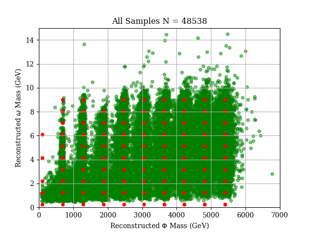

<!--flows README-->
- [Current Bugs/Issues/"Features"](#current-bugsissuesfeatures)
- [Goals of Flows-Enriched Data Generation for High-Energy EXperiment (FEDHEX)](#goals-of-flows-enriched-data-generation-for-high-energy-experiment-fedhex)
- [Getting Started](#getting-started)
  - [Generating Data](#generating-data)
  - [Running An Experiment](#running-an-experiment)
  - [Performing Analysis](#performing-analysis)

# Current Bugs/Issues/"Features"
 - All information pertinent to a run is contained in `defs.py` and should be treated as read-only during a run. A copy of all of the run variables from `defs.py` are stored in `config.json` in the directory containing the rest of the saved model. Albeit convenient to have a large dictionary of constants at run time for all local modules to see, it makes running a new model a bit tedious, by way of having to entire a file and change a few constants for every new run. Realistically, constants should be constants. These other parameters should be stored as a separate configuration file and loaded globally into the program namespace. These could also be treated as command-line args or GUI toggles/entries. No telling what the future holds.
 - The checkpointing callback does not save exactly at the epoch interval desired. I think this is likely a rounding issue as it looks to save based on the n-th batch, not the n-th epoch. So dividing total data size by batchsize produces yields an extra training step in the epoch to finish the last batch/cover the remainder. The math for the saving frequency for ckpt does not take this into account. Perhaps find a way to align checkpointing with epochs, though this is more an aesthetic/meta-accuracy thing than critical to the model's success.

# Goals of Flows-Enriched Data Generation for High-Energy EXperiment (FEDHEX) 

Given a sparse collection of event distributions in an N-dimensional parameter space, we want to interpolate between the given distributions to generate new distributions

For example, a hypothetical interaction between two particles, yielding a scalar $\Phi$ and pseudoaxion (pseudoscalar) $\omega$, can be modelled as such.



We wish to get the accuracy to within ~1% of MCMC-generated data.

# Getting Started

Create a new environment using (ana/mini)conda package manager:

```conda create -n flows3.10 python=3.10 matplotlib numpy scikit-learn scipy tensorflow-base tensorflow-probability uproot```

| req. pkgs              | vsn    | opt. pkgs | vsn    | use                                       |
| :--------------------- | :----- | :-------- | :----- | :---------------------------------------- |
| matplotlib             | 3.7.1  | bokeh     | 3.1.1  | interactive visualization                 |
| numpy                  | 1.25.0 | jupyter   | 1.0.0  | good to test short bits of code           |
| python                 | 3.10   | pytorch   | 2.0.0  | may port network to pytorch               |
| scikit-learn           | 1.2.2  | seaborn   | 0.12.2 | good for visualization of scientific data |
| scipy                  | 1.10.1 |           |        |                                           |
| tensorflow             | 2.11.1 |           |        |                                           |
| tensorflow-probability | 0.19.0 |           |        |                                           |
| uproot                 | 5.0.8  |           |        |                                           |

## Generating Data

The ```main.py``` script defines the main workflow for all necessary procedures in the normalizing flows pipeline. To start, the experiment will require training data, which can be generated or imported, depending on the use case. In the cases ```LINE``` and ```GRID```, samples come from various different 2D Gaussians according to the parameters in ```defs.py```. In the case of ```ROOT```, the data 'generation' is merely loading in samples from a .ROOT file, usually generated via MCMC for a given process.

## Running An Experiment

FIRST! Check ```defs.py``` for the parameters of the run. These parameters must be updated appropriately if one wishes to load a network correctly as well. A run's full parameter set is stored in each model's directory as ```config.json``` - do NOT name a file that if you wish to keep its contents or the run's parameters.

The ability to load a run from its parameter config file will be implemented in the near future. Until then, PARAMETERS MUST BE MANUALLY ENTERED INTO ```defs.py``` BEFORE EACH RUN. This includes the directories and names used for the model, data, output, etc.

To run the network:
```python main.py```

--- OR ---

``` py
# Defines where checkpoints are saved with optional format string for the epoch at the time of saving
ckptpath = flowpath + "/cp-{epoch:04d}.ckpt"
# For unsupervised learning, the target vector y is zeros
model.fit(x=[samples, labels],
        y=np.zeros((samples.shape[0], 0), dtype=np.float32),
        shuffle=True,
        batch_size=defs.batch_size,
        epochs=defs.nepochs,
        verbose=0,
        initial_epoch=0 if defs.newmodel else defs.epoch_resume,
        callbacks=[
            keras.callbacks.ModelCheckpoint(
                filepath=ckptpath,
                verbose=1,
                save_weights_only=False,
                save_freq=int(defs.epoch_save * len(samples) / defs.batch_size)),
            myutils.SelectiveProgbarLogger(
                verbose=1,
                epoch_interval=10,
                epoch_end=defs.nepochs)])

# Simple to save the model!
model.save(flowpath)
```

to load a saved model:
``` py
# Load an entire model (not checkpoint) from specified directory
model = keras.models.load_model(modeldir, custom_objects={"lossfn": flowmodel.lossfn, "Made": flowmodel.Made})
made_blocks = []
for i in range(defs.nmade):
    made_blocks.append(model.get_layer(name=f"made_{i}"))

# Create just the bijection `distribution` necessary for generating new samples
distribution, made_list = flowmodel.build_distribution(made_blocks, defs.ndim)
```

to use a saved flow
``` py
# Sample the flow at the given label(s) for defs.ngen samples
gen_labels = np.repeat([[2464., 5.125]], defs.ngen, axis=0)

# Define the conditional input (labels) for the flow to generate
current_kwargs = {}
for i in range(defs.nmade):
    current_kwargs[f"maf_{i}"] = {"conditional_input" : gen_labels}

# Generate the data given the test labels!
gen_data = np.array(distribution.sample((gen_labels.shape[0], ), bijector_kwargs=current_kwargs))
```

Important locations (these are defaults that can be changed):

Training data are stored in ```./data``` in the numpy .npy format

Models are stored ```./model``` in the keras SavedModel format from which they can be loaded in their entirety once constructing the modeul using ```flowmodel.build_distribution```.

Output from analysis is stored in ```./output```

When loading ROOT data, the loading algorithm traverses the entire directory tree looking for .ROOT files. Make sure there are ONLY directories or .ROOT files in the entire directory tree specified by ```root_dir```

## Performing Analysis

Running ```python main.py``` saves the version of ```defs.py``` at run-time in the same directory where the model is stored.

Change relevant parameters in defs before running the model or analysis script. Make sure to update ALL parameters relevant to a run. This includes flags, directories, 'names' (used to locate data or models), epochs for re-training, etc.

Check out ```analysis_example.py``` for an example analysis or ```analysis_utils.analyze```, the default analysis behavior when running ```main.py```. There are other examples in this github that were more so tools for testing behavior of different functions, libraries, and the network itself, but I figure they may be useful to look at as guides. They may not run; these scripts serve as examples of the pipeline of a subset of instructions in different parts of the flow workflow, i.e., data generation/loading, plotting, comparing generated data to training data.