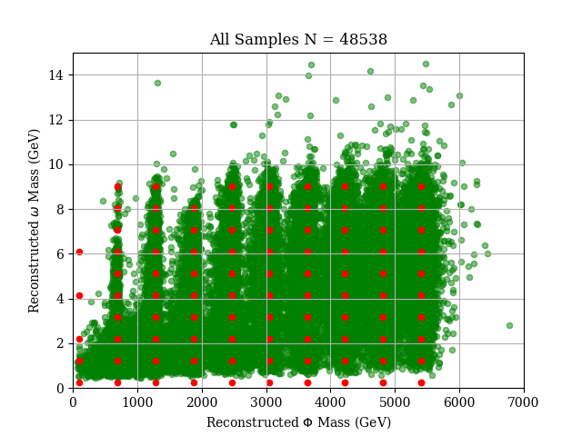
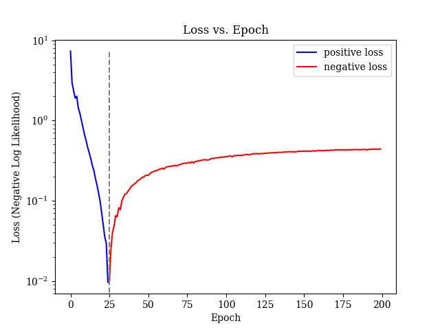

<!--flows README-->
- [Current Bugs/Issues/"Features"](#current-bugsissuesfeatures)
- [Goals of Flows-Enriched Data Generation for High-Energy EXperiment (FEDHEX)](#goals-of-flows-enriched-data-generation-for-high-energy-experiment-fedhex)
- [Getting Started](#getting-started)
  - [Generating Data](#generating-data)
  - [Running An Experiment](#running-an-experiment)
  - [Performing Analysis](#performing-analysis)

# Current Bugs/Issues/"Features"
 - networks with multiple layers are not being saved or loaded correctly. They don't get evaluated correctly at the very least.
 - The checkpointing callback does not save exactly at the epoch interval desired. I think this is likely a rounding issue as it looks to save based on the n-th batch, not the n-th epoch. So dividing total data size by batchsize produces yields an extra training step in the epoch to finish the last batch/cover the remainder. The math for the saving frequency for ckpt does not take this into account. Perhaps find a way to align checkpointing with epochs, though this is more an aesthetic/meta-accuracy thing than critical to the model's success.

# Goals of Flows-Enriched Data Generation for High-Energy EXperiment (FEDHEX) 

Given a sparse collection of event distributions in an N-dimensional parameter space, we want to interpolate between the given distributions to generate new distributions

For example, a hypothetical interaction between two particles, yielding a scalar $\Phi$ and pseudoaxion (pseudoscalar) $\omega$, can be modelled as such.



We wish to get the accuracy to within ~1% of MCMC-generated data.

# Getting Started

Create a new environment using (ana/mini)conda package manager:

```conda create -n flows3.10 --file requirements.txt```

## Generating Data


## Running An Experiment


To run the network:


--- OR ---

``` py

```

to load a saved model:
``` py

```

to use a saved flow
``` py

```


Look how a model network performs:



## Performing Analysis


")